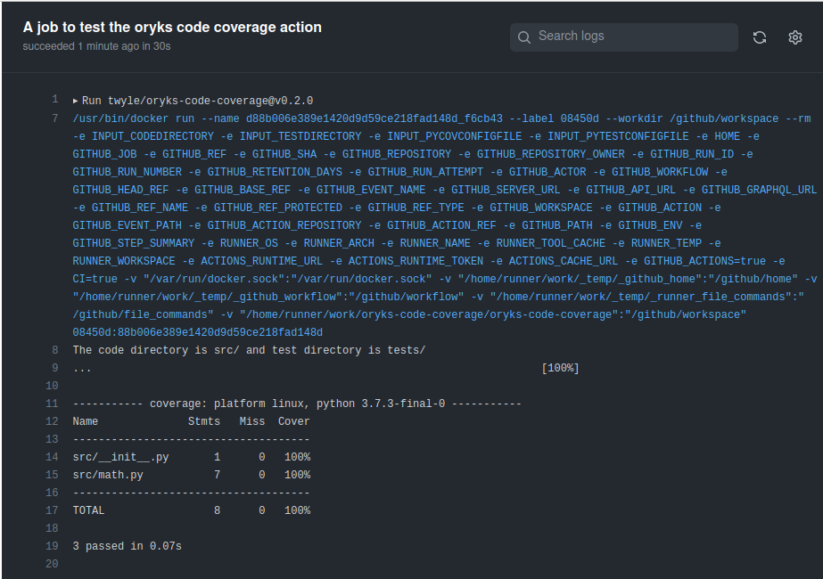

# oryks-code-coverage

> This GitHub Action shows Code Coverage for a given project.


[![security: bandit][bandit-image]][bandit-url]
[![Imports: isort][isort-image]][isort-url]
[](https://www.python.org/)
[](https://github.com/Naereen/StrapDown.js/blob/master/LICENSE)


This GitHub Action shows code Coverage for a given python project using Pytest Coverage. To use this action, your project must have tests written using pytest and stored in a test folder. You can read about how it was developed over at [How To Create a GitHub Action that Shows Code Coverage using Pytest](https://medium.com/@lyle-okoth/creating-a-pytest-github-action-that-shows-code-coverage-b0d11655b748)



## Inputs

## `codedirectory`

**Required** The directory containing the source code. Default `"."`.

## `testdirectory`

**Required** The directory containing the tests. Default `"tests\"`.

## `pycovconfigfile`

**Optional** The pycov configuration file Default `".coveragerc"`.

## `pytestconfigfile`

**Optional** The pytest configuration file. Default `"setup.cfg"`.
## `github_token`

**Required** The GitHub Token. Default `"${{ github.token }}"`.

## `github_token`

**Required** The GitHub Token. Default `"."`.

## `oryks_token`

**Required** The Code Coverage. Default `"."`

## Outputs

## `testcoverage`

The Test coverage

## Example usage
```
- name: oryks code coverage action
  id: selftest
  uses: twyle/oryks-code-coverage@v0.17.1
  with:
    codedirectory: src/
    testdirectory: tests/
    github_token: ${{ github.token }}
    oryks_token: ${{ secrets.ORYKS_TOKEN }}

- name: action output
  run: |
    echo "${{ steps.selftest.outputs.testcoverage }}
```

[bandit-image]: https://img.shields.io/badge/security-bandit-yellow.svg
[bandit-url]: https://github.com/PyCQA/bandit

[isort-image]: https://img.shields.io/badge/%20imports-isort-%231674b1?style=flat&labelColor=ef8336

[isort-url]: https://pycqa.github.io/isort/
